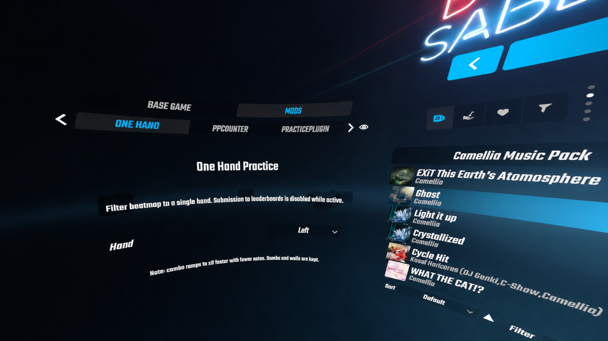
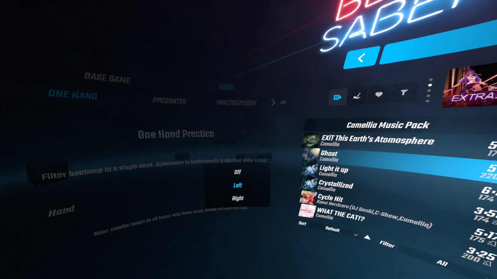

# One Hand Practice

Practice **any Beat Saber map** with only **one hand**. Filters out the opposite-color notes, keeps bombs and walls in place, hides the off-hand saber, and recalculates your percentage over the notes that actually played. Submission to leaderboards is disabled automatically while the filter is active so your real ranks stay clean.

<p align="center">
  
</p>

---

## Why use this?

If a hard pattern fails because your weaker hand is off-sync with the stronger one, drilling that hand alone over a real map (instead of mentally ignoring half the notes) makes the practice clean:

- The other hand's cubes don't get in the way of your active saber.
- The opposite saber is hidden — you can't accidentally bomb-hit yourself with it.
- Percentage at the end reflects what you actually played, not score / total-notes-in-map.

---

## Requirements

Supported Beat Saber versions (Steam or Oculus PC) — pick the zip that matches your game:

| Zip | Works for | BSIPA | BSML | SiraUtil | BS Utils |
|---|---|---|---|---|---|
| **`bs1.39.1.zip`** | 1.39.1 | 4.3.6 | 1.12.4 | 3.1.14 | 1.14.2 |
| **`bs1.40.8.zip`** | 1.40.0 – 1.40.8 | 4.3.6 | 1.12.5 | 3.2.1  | 1.14.2 |
| **`bs1.43.0.zip`** | 1.41.x – 1.43.0 | 4.3.7 | 1.14.1 | 3.3.1  | 1.14.3 |

BSManager installs the dependency mods automatically at the right version when you pick a Beat Saber instance.

> If your Beat Saber version sits between two zips (e.g. 1.40.4), use the closer one. BSIPA enforces an exact `gameVersion` match by default, so you may need to set `Regenerate = true` or `IgnoreGameVersion = true` in `UserData/Beat Saber IPA.json` once. Directly tested on **1.39.1**, **1.40.8** and **1.43.0**.

---

## Install

### Easiest — via BSManager *(once approved on Lunar Mods / BeatMods)*

1. Open **BSManager**.
2. Pick your Beat Saber 1.39.1 install.
3. Go to **Mods** → search **One Hand Practice** → click **Install**.
4. Launch the game.

That's it. BSManager pulls dependencies automatically.

> **Status:** pending approval on Lunar Mods. Until then, use the manual install below.

### Manual install

1. Make sure the dependencies above are installed for your Beat Saber version (use BSManager).
2. Download the zip from the [latest release](../../releases/latest) that matches your Beat Saber version per the table above. There is one zip per dep group (`bs1.39.1`, `bs1.40.8`, `bs1.43.0`).
3. Extract it **into your Beat Saber folder** (the one with `Beat Saber.exe`). The zip is structured so it drops `OneHandPractice.dll` straight into your `Plugins\` folder.
4. Launch the game.

If extraction didn't put the file in the right place, you can manually copy `OneHandPractice.dll` into `<Beat Saber>\Plugins\`.

> **Heads up:** the wrong-version zip will be refused by BSIPA at startup (`manifest gameVersion` is strict). Pick the zip that matches your game.

---

## Usage

1. Launch Beat Saber, enter **Solo**.
2. In the panel on the left side of the song list, switch the top tab to **Mods**.
3. Find the **One Hand** tab. Mod tabs paginate three at a time — use the **left / right arrows** to find it (its position depends on how many mods you have installed).

   <p align="center">
     
   </p>

4. Pick **Left**, **Right** or **Off** from the dropdown.

   <p align="center">
     
   </p>

5. Pick a song and play. Only the selected hand's notes will spawn, and the other saber disappears.

Your choice persists between sessions.

---

## What gets filtered, what doesn't

| Item | Filter behavior |
|---|---|
| Notes of the active hand | Kept |
| Notes of the opposite hand | Removed |
| Arcs / chains starting on the active hand | Kept |
| Arcs / chains starting on the opposite hand | Removed |
| Bombs | **Kept** — keep training avoidance |
| Walls / obstacles | **Kept** |
| Lights, BPM changes, color events | Untouched |

Modes where the filter is **always off** (so nothing breaks):

- Multiplayer
- Campaign (official + Custom Campaigns)
- Party mode

Solo standard play is the only place the filter applies.

---

## Troubleshooting

**I don't see the One Hand tab in the gameplay setup panel.**
- Make sure all dependencies (BSML, SiraUtil, BS Utils) are installed and at the right version.
- Confirm `OneHandPractice.dll` is in `<Beat Saber>\Plugins\`.
- Check `<Beat Saber>\Logs\_latest.log` for a line like `[One Hand Practice] OneHandPractice loaded`. If it isn't there, the plugin failed to load — usually a missing dependency or wrong game version.

**Score percentage looks wrong.**
- It isn't: it's calculated over the notes that actually spawned. If you cleared all the filtered notes, you should see ~100% (cut quality permitting).
- The PP shown by mods like PP Predictor / PPCounter will look inflated because they don't know about the filter. Since submission is disabled, those PP numbers never leave your machine.

**BeatSaviorUI shows "Default Text" on its results panel (often for both hands).**
- BeatSaviorUI's post-play stats binding gives up when the chart it sees doesn't match what it expected — and our filtered chart triggers that. Not a bug in this mod and nothing here can fix it cleanly without patching BSU itself.
- Your in-game score / rank / percentage on the standard results screen are still correct.

**My run wasn't submitted to ScoreSaber / BeatLeader / official leaderboard.**
- Correct, that's the point. The filter changes the chart from what was ranked, so submitting would create false scores. Turn the filter to **Off** to play normally.

**Combo ramps to x8 multiplier faster than usual.**
- Expected. With half the notes, fewer hits are needed to reach the multiplier ceiling.

---

## For developers

Want to build from source, contribute, or fork this for another Beat Saber version?

### Building

Requires **.NET SDK 8 or 9** and a Beat Saber install for whatever version you want to target.

```powershell
$env:BeatSaberDir = "D:\path\to\Beat Saber"
dotnet build OneHandPractice.sln -c Release
```

`BeatSaberModdingTools.Tasks` resolves game references via the `BeatSaberDir` env var and drops the built DLL into `<Beat Saber>\Plugins\` automatically.

### Multi-version builds

`release.ps1` builds Release zips for every supported BS version in a single pass. Same source code; per-version manifests in `OneHandPractice/manifest-<version>.json` carry the right `gameVersion` and dependency floors.

```powershell
pwsh release.ps1                       # builds 1.39.1, 1.40.8, 1.43.0
pwsh release.ps1 -BsVersion 1.43.0     # builds just one version
```

Outputs `dist\OneHandPractice-<plugin-version>-bs<bs-version>.zip` for each target — ready to attach as GitHub Release assets.

The script auto-discovers BSManager's `BSInstances\` folder (checks the usual AppData and C:/D: drive paths). If yours lives somewhere else, pass `-BsManagerInstancesDir` or set the `BSMANAGER_INSTANCES_DIR` environment variable to the folder containing your version subfolders.

### Tests

```powershell
dotnet test OneHandPractice.Tests/OneHandPractice.Tests.csproj
```

The filter logic is pure-function and fully unit tested — no Beat Saber DLLs needed to run the test suite.

### Architecture sketch

- `Configuration/Hand.cs`, `HandSelection.cs`, `PluginConfig.cs` — typed enum, in-memory state, BSIPA-persisted config.
- `Services/NoteFilterService.cs` — pure filter predicate, no game dependency.
- `Services/ScoreSubmissionGate.cs` — wraps BS_Utils `ScoreSubmission.DisableSubmission`.
- `Services/GameModeGate.cs` — tracks active scene mode (Solo / Party / Multiplayer / Mission).
- `HarmonyPatches/BeatmapDataFilterPatch.cs` — postfix on `BeatmapDataTransformHelper.CreateTransformedBeatmapData`. Filters via `IReadonlyBeatmapData.GetFilteredCopy`.
- `HarmonyPatches/SaberHidePatch.cs` — postfix on `SaberManager.Start` — disables the off-hand saber GameObject.
- `HarmonyPatches/GameModeCapturePatch.cs` — prefix on every `*LevelScenesTransitionSetupDataSO.Init` to capture the active mode.
- `UI/OneHandSettings.bsml` + `OneHandSettingsViewController.cs` — Gameplay Setup tab.

### Translation / localization

All user-visible strings live in `Resources/Strings.cs`. To add another language, duplicate that class behind a switch on `CultureInfo.CurrentUICulture` or wire up [SiraLocalizer](https://github.com/Auros/SiraLocalizer) — both paths are designed for.

---

## License

[MIT](LICENSE) — do whatever, attribution appreciated.
